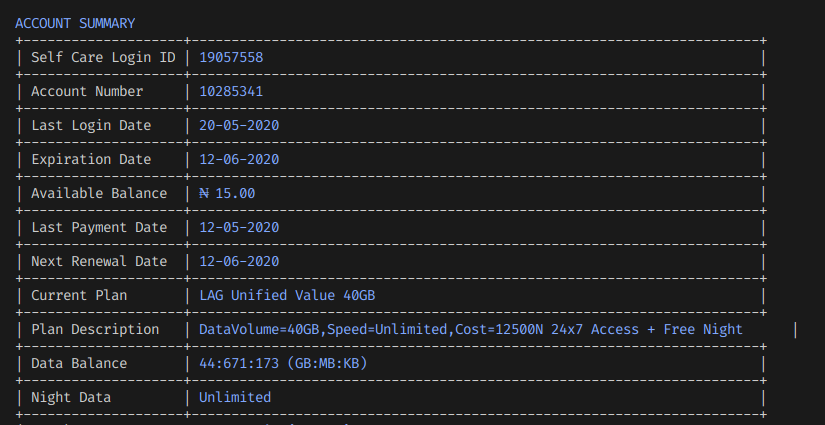

# Spectranet Subscription Details

I build this tool because I was tired of having to login to spectranet website to check my data status.
With this script you can just see your spectranet subsciption info and data with just one command.

## Getting started

- clone repository and `cd specranet_scraper`
- create a python virtual env `python -m venv .venv` and activate it
- run `pip install -r requirements.txt` to install dependencies
- export `SPECTRANET_LOGIN_USERNAME` & `SPECTRANET_LOGIN_PASSWORD` environment variables which should contain your spectranet login username and password respectively. You can also set your username and password by editing the source code SPECTRANET_USERNAME & SPECTRANET_PASSWORD variables.
- run `python spectranet.py` to test code.

## Building Project

- run `install.sh` to build an executable binary`spectranet`.
- run `./spectranet` or just `spectranet` to execute.

### How to contribute

If you have some interesting feature to add or an issue, please feel free to send me a mail or just a create a Pull Request or issue.
